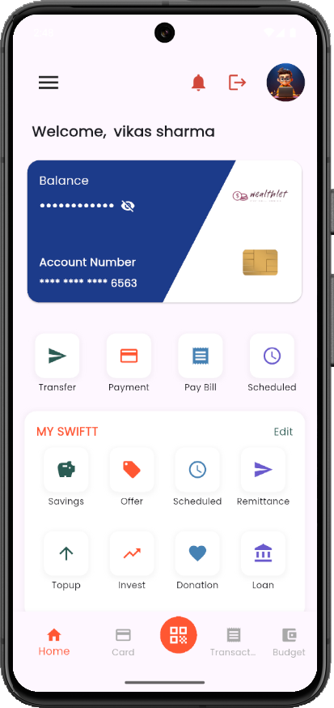
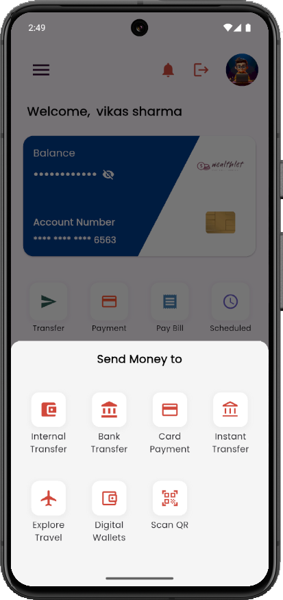
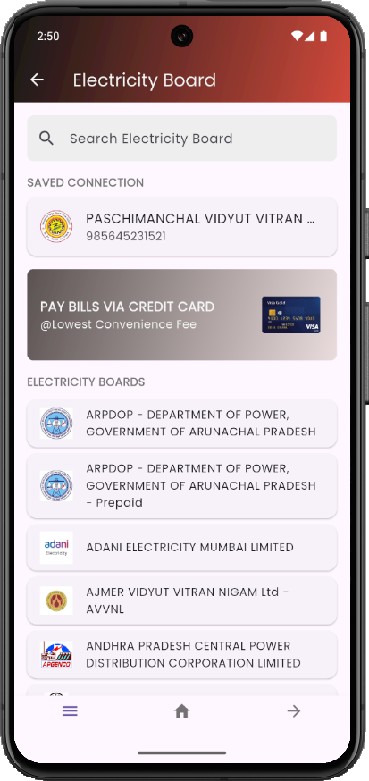
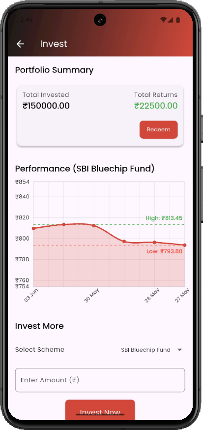
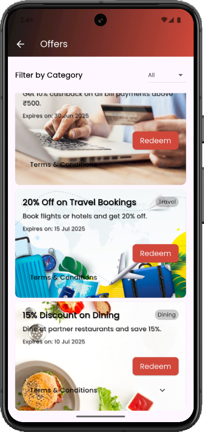
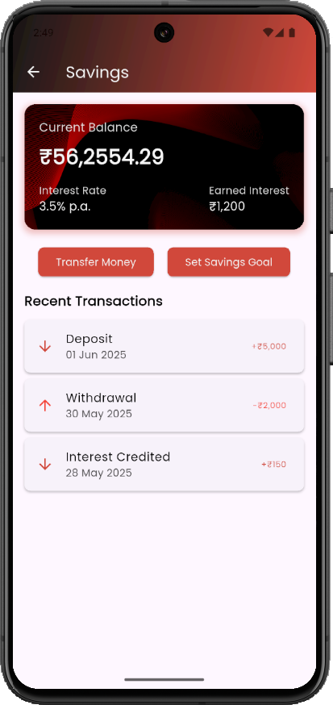
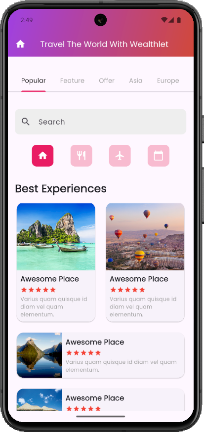
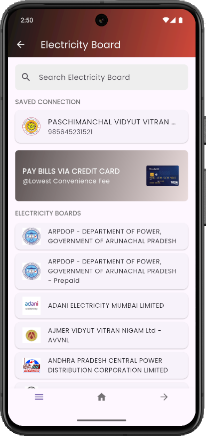

# 💼 WealthLet — Personal Finance Management Web App

WealthLet is a powerful and intuitive personal finance management platform designed to help users track income, expenses, and savings efficiently. Built with a modern tech stack, this web application demonstrates practical skills in full-stack development, UI/UX design, and data handling — making it a standout portfolio project for developers aiming to showcase real-world problem solving.

## 🚀 Live Demo

📸 Screenshots

## 📸 Screenshots

  
  
  
  
  
  
  
  
  
  

---

## 🧩 Key Features

- 🔐 **User Authentication** – Secure sign-up & login with session management
- 💰 **Expense & Income Tracking** – Add, update, and delete financial transactions
- 📊 **Analytics Dashboard** – Visual insights via graphs and summaries
- 📂 **Categorization** – Organize finances by custom tags or categories
- 📆 **Date-wise Filtering** – View spending trends over time
- 🌙 **Dark Mode** – Responsive and modern UI with theme toggle

---

## 🛠️ Tech Stack

### Frontend
- **React.js**
- **Tailwind CSS**
- **Context API / Redux (if used)**

### Backend
- **Node.js**
- **Express.js**
- **MongoDB (Mongoose)**

### Tools & Utilities
- **JWT Authentication**
- **Axios**
- **Chart.js / Recharts (for graphs)**
- **Vercel / Netlify / Render (for deployment)**

---

## 📁 Folder Structure (Example)
